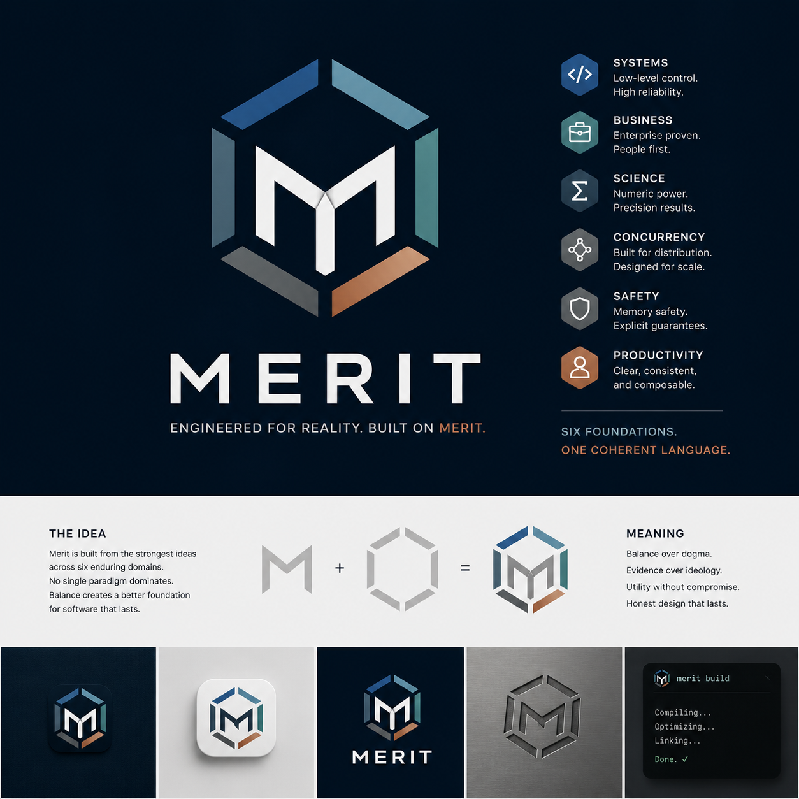

# Merit — Epoch III Generic Type Engine

<p align="center">
  
</p>

Merit is a native compiled language experiment centered on deterministic semantics, exact numerics, ownership, explicit allocation, contracts, stable layouts, capability-specific hazardous operations, and C interoperability.

This export is prepared for continued development in Codex. Start with:

- `AGENTS.md` — repository rules and invariants
- `CODEX_HANDOFF.md` — verified state and architecture
- `NEXT_WORK.md` — the next complete subsystem and acceptance gates
- `STATUS.md` — current alpha-gate evidence and remaining work
- `LIMITATIONS.md` — deliberately unsupported first-alpha behavior
- `IMPORT_INTO_CODEX.md` — import instructions

## Baseline

```bash
./scripts/bootstrap.sh
./scripts/test.sh
```

The completed `v0.1.0-alpha.1` local gate is now followed by `v0.1.0-alpha.2` replacement-compiler development. The current local gate runs 356 tests plus nine interpreter/native project verifiers, including the Merit-native bootstrap lexer, typed declaration index, and independent differential corpus. See `STATUS.md`, `ROADMAP.md`, and `VERIFIED_BASELINE.md`.

## Current checkpoint

Implemented generic syntax includes explicitly instantiated generic structs, payload enums, and functions with compiler-defined bounds:

```merit
struct Pair<T, U> {
    first: T;
    second: U;
}

enum Option<T> {
    Some(T),
    None
}

fn maximum<T: Ord>(left: T, right: T) -> T {
    if (left >= right) { return left; }
    return right;
}
```

Generic declarations are monomorphized into nominal declarations before the established semantic, ownership, MIR, interpreter, and C-backend pipeline. Project builds support generic templates, instantiation sites, and trait impl evidence split across imported modules.

## CLI

```bash
merit check program.mrt
merit verify program.mrt
merit layout program.mrt
merit audit program.mrt
merit-project check PATH
merit-project verify PATH
merit-project run PATH
merit-project layout PATH
merit-project audit PATH
```

The current systems checkpoint supports user-declared traits, coherent impls, project-wide generic trait-bound dispatch, allocator-backed `Vec<T>` support for scalars/generic structs/owned `Buffer` elements/owned structs, parsed generic-style vector intrinsic calls such as `vec_new<i64>`, compile-time `Vec<T>` and enum layout assertions, layout hash reporting for structs/generated vectors/enums, hazardous operation audit reporting with explicit capability policy metadata, aggregate drop glue for structs with owned fields, owned enum payloads for `Option<Vec<i64>>` / `Result<Vec<i64>, Error>` style code, contract checking with deterministic interpreter/native precondition and postcondition failure behavior, typed capability-gated filesystem results with interpreter/native OS-failure parity, explicit owned-storage replacement, shared typed lifecycle metadata, and source-aware ownership diagnostics with move/drop origin notes. Remaining work is scoped in `NEXT_WORK.md`.

---

The previous release README is retained as `README.previous.md` for historical detail.
